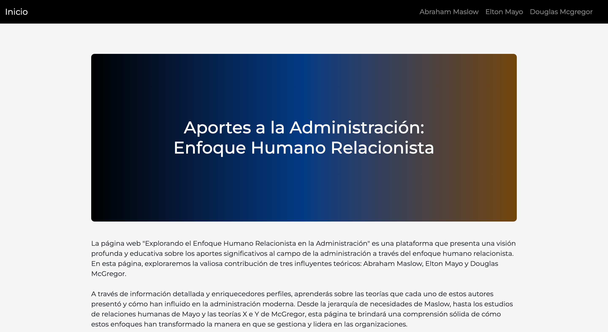

# Human Insights and Management Theories App

The Human Insights and Management Theories App is a comprehensive web application that delves into the profound contributions of Elton Mayo, Abraham Maslow, and Douglas McGregor to the fields of psychology, human behavior, and management. This app serves as an educational resource, shedding light on their theories and their impact on modern management practices. Through user-friendly interfaces and interactive content, users can explore the foundational concepts that have shaped organizational dynamics. You can access the live application here: [Human Insights and Management Theories App](https://human-insights-app.netlify.app).

## Features

- **Theories Exploration**: The app presents detailed insights into the theories of Elton Mayo, Abraham Maslow, and Douglas McGregor, highlighting their key concepts and contributions.

- **Interactive Learning**: Users can engage with interactive content that explains complex theories in an easy-to-understand manner.

- **Application to Management**: Learn how these theories have influenced management styles, leadership approaches, and organizational culture.

- **Responsive Design**: The app is designed to provide a seamless experience on various devices, from desktop to mobile.

## How to Use the App

1. Open your web browser and visit [Human Insights and Management Theories App](https://human-insights-app.netlify.app).

2. On the main page, you'll find sections dedicated to each theorist—Elton Mayo, Abraham Maslow, and Douglas McGregor.

3. Click on the theorist's section you're interested in to explore their background, theories, and impact on management.

4. Engage with interactive content, such as quizzes and visual representations, to deepen your understanding of the theories.

## Technologies Used

- HTML
- CSS
- JavaScript
- Interactive Learning Modules
- Educational Resources

## Contributions

Contributions are welcome. If you'd like to enhance the app's content, improve its design, or contribute additional interactive learning modules, you can fork this repository, make your changes, and then create a pull request.

## Contact

For any inquiries, suggestions, or comments about the Human Insights and Management Theories App, please contact us via [your email or social media].

Explore the app to gain a deeper understanding of the theories that have shaped human behavior and management practices throughout history!

